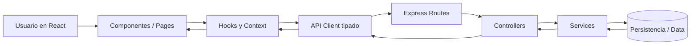

# PITUTI — Design y arquitectura

## 1. Objetivo de la arquitectura
La arquitectura de PITUTI está diseñada para soportar una aplicación fullstack enfocada en el cuidado compartido de mascotas, con una separación clara entre frontend, backend y capa de datos.

El objetivo principal es que varios tutores puedan consultar, crear y actualizar información sobre un mismo perro o gato desde una única fuente de verdad, manteniendo el historial de acciones, eventos de salud, alimentación, documentos y recordatorios.

La arquitectura busca ser:
- Clara y fácil de mantener.
- Escalable para nuevas funcionalidades.
- Tipada de extremo a extremo.
- Adecuada para trabajo por capas.
- Preparada para consumo de API REST.
- Reutilizable tanto en componentes como en lógica de negocio.

## 2. Arquitectura general
PITUTI tendrá una arquitectura cliente-servidor:

- **Frontend**: React + TypeScript + Tailwind CSS + React Router.
- **Backend/API**: Node.js + Express.
- **Comunicación**: API REST bajo `/api/v1`.
- **Persistencia**: datos principales en el backend; estado temporal de interfaz en el frontend.

La aplicación seguirá una estructura de capas:
- **Routes**: definen las rutas HTTP.
- **Controllers**: reciben la petición y construyen la respuesta.
- **Services**: contienen la lógica de negocio.
- **Config**: centraliza configuración y utilidades de entorno.

## 3. Estructura de carpetas

### Frontend
```text
src/
├── api/
├── components/
├── context/
├── hooks/
├── pages/
├── types/
├── utils/
├── App.tsx
└── main.tsx
```

### Backend
```text
server/
└── src/
    ├── routes/
    ├── controllers/
    ├── services/
    ├── config/
    ├── middlewares/
    ├── types/
    └── app.ts
```

## 4. Componentes principales del frontend

### Layout y navegación
- `AppLayout`
- `Sidebar` o `TopNav`
- `LanguageSwitcher`
- `ThemeToggle`
- `PageHeader`

### Dashboard
- `OverviewCard`
- `UpcomingRemindersCard`
- `RecentActivityCard`
- `PetSummaryCard`
- `AlertBanner`

### Gestión de mascotas
- `PetCard`
- `PetProfileHeader`
- `PetDetailsSection`
- `PetForm`
- `PetAvatarUploader`

### Salud y seguimiento
- `VaccineList`
- `MedicationList`
- `SymptomLogList`
- `SymptomForm`
- `FeedingLogList`
- `DailyNotesPanel`
- `VetHistoryTimeline`

### Colaboración compartida
- `CaregiverList`
- `InviteCaregiverModal`
- `ShareCodeCard`
- `ActivityLogList`

### Documentos y recursos
- `DocumentUploader`
- `DocumentList`
- `ClinicMap`
- `EmergencyClinicCard`

### UI reutilizable
- `Button`
- `Input`
- `Select`
- `Textarea`
- `Modal`
- `Card`
- `Badge`
- `EmptyState`
- `Loader`
- `ConfirmDialog`
- `Toast`

## 5. Componentes reutilizables
Los componentes reutilizables serán aquellos que puedan usarse en varias pantallas con distintas props y sin depender de un contexto específico.

### Componentes reutilizables previstos
- `Button`
- `Card`
- `Input`
- `Select`
- `Textarea`
- `Modal`
- `Badge`
- `Loader`
- `EmptyState`
- `PageHeader`
- `SectionTitle`
- `StatusPill`
- `InfoRow`

### Criterios para considerarlos reutilizables
Un componente se considerará reutilizable si:
- Tiene una responsabilidad visual o funcional concreta.
- Recibe datos mediante props tipadas.
- No contiene lógica de negocio acoplada a una única página.
- Puede utilizarse en más de un flujo de la app.

## 6. Gestión de estado
La gestión del estado seguirá un enfoque mixto:

### Estado local
Se usará `useState` para:
- Inputs de formularios.
- Modales abiertos/cerrados.
- Filtros temporales.
- Estados visuales locales.

### Estado de efectos y carga
Se usará `useEffect` para:
- Cargar datos al entrar en una página.
- Sincronizar parámetros o filtros.
- Ejecutar llamadas a la API cuando sea necesario.

### Estado derivado y optimización
Se usará:
- `useMemo` para cálculos derivados costosos, como filtrado de registros, agrupaciones o métricas del dashboard.
- `useCallback` para estabilizar funciones pasadas a componentes hijos y evitar renders innecesarios.

### Estado global
Se usará Context API para compartir:
- Usuario autenticado.
- Idioma actual.
- Mascota seleccionada.
- Lista resumida de pets del usuario.
- Datos globales de recordatorios o notificaciones visuales.

## 7. Custom hooks
Se crearán hooks reutilizables para encapsular lógica repetida.

### Hooks previstos
- `useAuth()` → gestión del usuario autenticado.
- `usePets()` → carga y acciones sobre mascotas.
- `useReminders()` → recordatorios de vacunas, medicación o tareas.
- `useDebounce()` → para búsquedas o filtros.
- `useTranslations()` → acceso al idioma activo y textos traducidos.

El objetivo es separar lógica de estado y efectos de los componentes visuales.

## 8. Context API
Se implementará al menos un contexto global principal:

### Contextos propuestos
- `AuthContext`
- `PetContext`
- `I18nContext`

### Ejemplo de responsabilidades
- `AuthContext`: usuario, login, logout, loading de sesión.
- `PetContext`: mascota activa, lista de pets, refresco de datos compartidos.
- `I18nContext`: idioma actual, cambio de idioma, textos visibles.

El uso de Context API es útil cuando varios componentes alejados en el árbol necesitan acceder al mismo estado sin pasar props manualmente en muchos niveles.

## 9. Diseño del backend/API
La API seguirá una estructura REST con versión en la URL.

### Base URL
```text
/api/v1
```

### Recursos principales
- `/auth`
- `/users`
- `/pets`
- `/pets/:petId/caregivers`
- `/pets/:petId/vaccines`
- `/pets/:petId/medications`
- `/pets/:petId/feedings`
- `/pets/:petId/symptoms`
- `/pets/:petId/notes`
- `/pets/:petId/documents`
- `/pets/:petId/vet-records`
- `/pets/:petId/activity-logs`
- `/clinics`

## 10. Endpoints principales

### Auth
- `POST /api/v1/auth/login`
- `POST /api/v1/auth/register`
- `GET /api/v1/auth/me`

### Pets
- `GET /api/v1/pets`
- `POST /api/v1/pets`
- `GET /api/v1/pets/:petId`
- `PUT /api/v1/pets/:petId`
- `DELETE /api/v1/pets/:petId`

### Caregivers
- `GET /api/v1/pets/:petId/caregivers`
- `POST /api/v1/pets/:petId/caregivers/invite`
- `POST /api/v1/pets/:petId/caregivers/join`
- `DELETE /api/v1/pets/:petId/caregivers/:caregiverId`

### Vaccines
- `GET /api/v1/pets/:petId/vaccines`
- `POST /api/v1/pets/:petId/vaccines`
- `PUT /api/v1/pets/:petId/vaccines/:vaccineId`
- `DELETE /api/v1/pets/:petId/vaccines/:vaccineId`

### Medications
- `GET /api/v1/pets/:petId/medications`
- `POST /api/v1/pets/:petId/medications`
- `PUT /api/v1/pets/:petId/medications/:medicationId`
- `DELETE /api/v1/pets/:petId/medications/:medicationId`

### Feedings
- `GET /api/v1/pets/:petId/feedings`
- `POST /api/v1/pets/:petId/feedings`

### Symptoms
- `GET /api/v1/pets/:petId/symptoms`
- `POST /api/v1/pets/:petId/symptoms`
- `PUT /api/v1/pets/:petId/symptoms/:symptomId`
- `DELETE /api/v1/pets/:petId/symptoms/:symptomId`

### Notes
- `GET /api/v1/pets/:petId/notes`
- `POST /api/v1/pets/:petId/notes`

### Documents
- `GET /api/v1/pets/:petId/documents`
- `POST /api/v1/pets/:petId/documents`
- `DELETE /api/v1/pets/:petId/documents/:documentId`

### Vet records
- `GET /api/v1/pets/:petId/vet-records`
- `POST /api/v1/pets/:petId/vet-records`

### Activity logs
- `GET /api/v1/pets/:petId/activity-logs`

### Clinics
- `GET /api/v1/clinics`
- `GET /api/v1/clinics?city=Madrid`
- `GET /api/v1/clinics?emergency=true`

## 11. Contratos de datos

### User
```ts
export interface User {
  id: string;
  name: string;
  email: string;
  avatarUrl?: string;
  preferredLanguage: 'pt' | 'es' | 'en';
  createdAt: string;
}
```

### Pet
```ts
export interface Pet {
  id: string;
  name: string;
  species: 'dog' | 'cat';
  breed?: string;
  birthDate?: string;
  weightKg?: number;
  color?: string;
  microchip?: string;
  heightCm?: number;
  passportNumber?: string;
  photoUrl?: string;
  createdAt: string;
  updatedAt: string;
}
```

### Caregiver
```ts
export interface Caregiver {
  id: string;
  userId: string;
  petId: string;
  role: 'owner' | 'caregiver';
  invitedBy: string;
  joinedAt: string;
}
```

### Vaccine
```ts
export interface Vaccine {
  id: string;
  petId: string;
  name: string;
  applicationDate: string;
  nextDoseDate?: string;
  notes?: string;
}
```

### Medication
```ts
export interface Medication {
  id: string;
  petId: string;
  name: string;
  dosage: string;
  frequency: string;
  startDate: string;
  endDate?: string;
  notes?: string;
}
```

### Symptom
```ts
export interface Symptom {
  id: string;
  petId: string;
  category: 'digestivo' | 'respiratorio' | 'piel' | 'comportamiento';
  severity: 'leve' | 'moderado' | 'grave' | 'emergencia';
  description: string;
  photoUrls?: string[];
  createdAt: string;
  createdBy: string;
}
```

### FeedingLog
```ts
export interface FeedingLog {
  id: string;
  petId: string;
  foodType: string;
  quantity: string;
  appetite: 'bajo' | 'normal' | 'alto';
  createdAt: string;
  createdBy: string;
}
```

### Note
```ts
export interface Note {
  id: string;
  petId: string;
  content: string;
  createdAt: string;
  createdBy: string;
}
```

### Document
```ts
export interface DocumentFile {
  id: string;
  petId: string;
  title: string;
  fileUrl: string;
  fileType: string;
  uploadedAt: string;
  uploadedBy: string;
}
```

### ActivityLog
```ts
export interface ActivityLog {
  id: string;
  petId: string;
  userId: string;
  action: string;
  entityType: string;
  entityId: string;
  createdAt: string;
}
```

## 12. Persistencia: servidor vs cliente

### Datos persistidos en el servidor
Se guardarán en el backend todos los datos que formen parte del dominio principal del producto:
- Usuarios.
- Mascotas.
- Tutores compartidos.
- Vacunas.
- Medicamentos.
- Alimentación.
- Síntomas.
- Notas.
- Documentos.
- Historial veterinario.
- Activity logs.
- Clínicas cargadas desde fuente propia o mockeada.

### Datos solo en cliente
Se mantendrán solo en el frontend los estados temporales de interfaz:
- Filtros activos.
- Orden visual de listas.
- Modal abierto o cerrado.
- Texto en formularios antes de enviar.
- Tabs seleccionadas.
- Estado local de loading visual puntual.

## 13. Flujo de datos
El flujo general de datos será el siguiente:



### Explicación del flujo
1. El usuario interactúa con la interfaz.
2. La página o componente dispara una acción.
3. Un hook o un contexto coordina el estado.
4. El cliente de API hace la petición HTTP.
5. Express recibe la petición por la ruta correspondiente.
6. El controller valida la entrada y llama al service.
7. El service aplica la lógica de negocio.
8. Se leen o escriben datos.
9. La respuesta vuelve al frontend.
10. La UI actualiza loading, error o success.

## 14. Cliente de API tipado
En el frontend existirá una capa de red centralizada.

### Archivos previstos
```text
src/api/
├── client.ts
├── auth.ts
├── pets.ts
├── vaccines.ts
├── medications.ts
├── symptoms.ts
├── notes.ts
├── documents.ts
└── clinics.ts
```

### Responsabilidades del cliente de API
- Centralizar `fetch`.
- Gestionar base URL.
- Añadir headers comunes.
- Tipar request y response.
- Normalizar errores.
- Evitar lógica de red duplicada en componentes.

## 15. Estrategia de páginas y rutas

### Rutas principales
- `/login`
- `/register`
- `/dashboard`
- `/pets`
- `/pets/new`
- `/pets/:petId`
- `/pets/:petId/health`
- `/pets/:petId/feedings`
- `/pets/:petId/symptoms`
- `/pets/:petId/documents`
- `/pets/:petId/caregivers`
- `/clinics`
- `*` → página 404

## 16. Decisiones de diseño técnico
Las decisiones principales de arquitectura son:

- Usar React con TypeScript para mantener componentes y contratos de datos tipados.
- Usar Tailwind CSS para acelerar el desarrollo visual sin perder consistencia.
- Usar React Router para separar pantallas y navegación.
- Usar Context API solo para estado realmente global.
- Mantener el estado de dominio en la API como fuente de verdad.
- Separar backend por capas para evitar mezclar HTTP con lógica de negocio.
- Diseñar endpoints REST por recursos y no por acciones.
- Dejar la internacionalización preparada desde la base del proyecto.

## 17. Decisiones visuales
PITUTI seguirá una línea visual clean y moderna:
- Cards con sombras suaves.
- Bordes redondeados.
- Mucho espacio en blanco.
- Colores suaves y estados bien diferenciados.
- Microinteracciones y transiciones fluidas.
- Diseño responsive mobile-first.

La intención es transmitir cuidado, confianza, claridad y coordinación compartida.

## 18. Riesgos y simplificaciones
Para mantener el proyecto viable, algunas funcionalidades se tratarán inicialmente de forma simplificada:

- Login simple sin sistema avanzado de permisos.
- Subida de documentos con almacenamiento básico o mock.
- Clínicas de Madrid con datos mockeados o fuente fija.
- Historial de localización como funcionalidad futura o demo limitada.
- Soporte multilenguaje inicialmente con diccionarios locales.
- Notificaciones en primera fase como alertas visuales dentro de la app.

## 19. Resumen arquitectónico
PITUTI se construirá como una aplicación fullstack con frontend tipado, backend por capas y API REST versionada. El foco principal de la arquitectura es soportar el cuidado compartido de mascotas de forma clara, mantenible y escalable, asegurando que todos los tutores consulten y actualicen una única fuente de verdad.